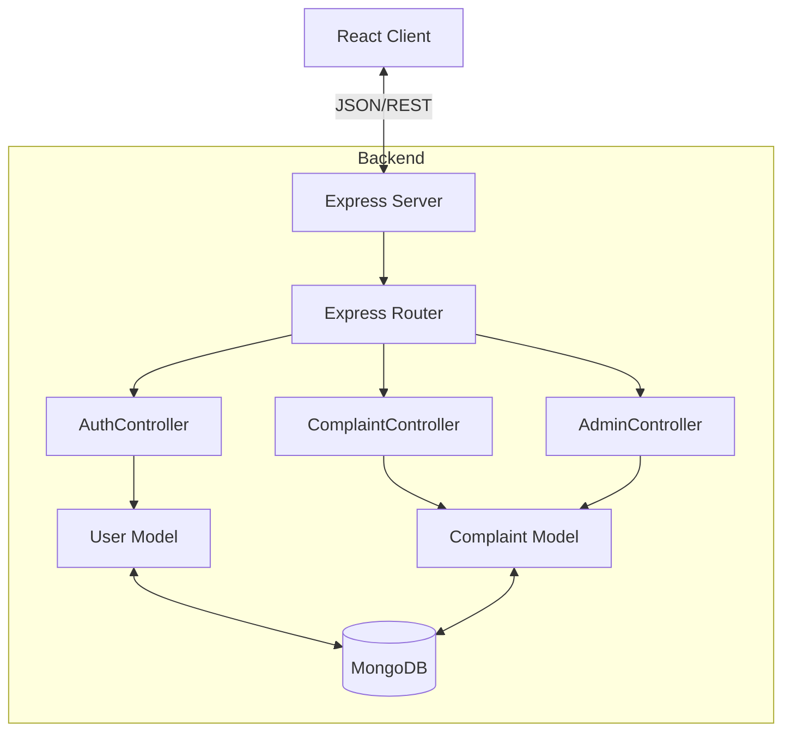

# System Architecture

## High-Level Overview

Dwello follows a standard **MERN Stack** architecture with a **Model-View-Controller (MVC)** design pattern on the backend.

## Directory Structure Strategy

- **`server/controllers/`**: Contains the business logic, separated from routing.
- **`server/routes/`**: Handles request routing and middleware application.
- **`server/models/`**: Defines the database schema and data validation.
- **`server/middleware/`**: Handles cross-cutting concerns like authentication (JWT).
- **`server/scripts/`**: Contains administrative utilities and maintenance scripts.
